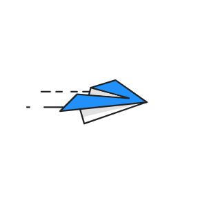

## Hi there, Aditya Verma is here 👋

 I’m currently pursuing my Undergraduate in **_Computer Science and Engineering_** from [Natioanl Institute of Technology Silchar.](http://www.nits.ac.in/) 
- 🔭 I’m currently working on backend projects.
- 🌱 I’m interested in competitive coding and web dev 💻 👨‍💻
- 🐱‍👤 I’m proficient in C++ and JavaScript 🤠

  

  

  

### Connect with me:

 

### Languages and Tools:

 
 

<!--   <code></code> -->
  <code></code>

